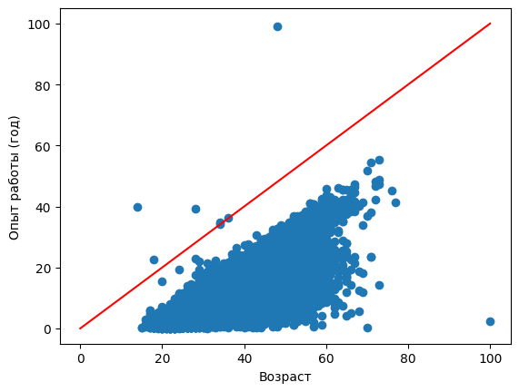

 

#  Проект_1: Анализ резюме из HeadHunter 

## Оглавление
[1. Описание проекта](https://github.com/SergeySarapulov/SF_DS/blob/main/project_1/README.md#Описание-проекта)  
[2. Какой кейс решаем?](https://github.com/SergeySarapulov/SF_DS/blob/main/project_1/README.md#Какой-кейс-решаем)  
[3. Краткая информация о данных](https://github.com/SergeySarapulov/SF_DS/blob/main/project_1/README.md#Краткая-информация-о-данных)  
[4. Этапы работы над проектом](https://github.com/SergeySarapulov/SF_DS/blob/main/project_1/README.md#Этапы-работы-над-проектом)  
[5. Результат](https://github.com/SergeySarapulov/SF_DS/blob/main/project_1/README.md#Результат)    
[6. Выводы](https://github.com/SergeySarapulov/SF_DS/blob/main/project_1/README.md#Выводы) 

### 1. Описание проекта    
Проанализировать данные резюме соискателей из HeadHunter из файла __dst-3.0_16_1_hh_database.csv__  и сделать выводы которые помогут проиллюстрировать влияние признаков/взаимосвязь между признаками/распределения признаков.

:arrow_up:[к оглавлению](https://github.com/SergeySarapulov/SF_DS/blob/main/project_1/README.md#Оглавление)

### 2. Какой кейс решаем?    
Нужно написать программу, которая позволит исследовать структуру исходных данных резюме соискателей, преобразовать и провести очистку данных, исследовать зависимости и взаимосвязи данных. 

### **Этапы исследования**  
###  Исследование структуры данных
  1. Прочитайте данные с помощью библиотеки Pandas
  2. Выведите несколько первых (последних) строк таблицы, чтобы убедиться в том, что ваши данные не повреждены. Ознакомьтесь с признаками и их структурой.
  3. Выведите основную информацию о числе непустых значений в столбцах и их типах в таблице.
  4. Обратите внимание на информацию о числе непустых значений.
  5. Выведите основную статистическую информацию о столбцах.
###  Преобразование данных
  1. В признаке **"Образование и ВУЗ"** его текущий формат это: **<Уровень образования год выпуска ВУЗ специальность...>**. Например:
Высшее образование 2016 Московский авиационный институт (национальный исследовательский университет)...
Неоконченное высшее образование 2000  Балтийская государственная академия рыбопромыслового флота…
Нас будет интересовать только уровень образования.
Создайте с помощью функции-преобразования новый признак **"Образование"**, который должен иметь 4 категории: "высшее", "неоконченное высшее", "среднее специальное" и "среднее".
Выполните преобразование, ответьте на контрольные вопросы и удалите признак "Образование и ВУЗ".
  2. Преобразовать столбец **"Пол, возраст"**. Сейчас он представлен в формате **<Пол , возраст , дата рождения >**. Например:
Мужчина , 39 лет , родился 27 ноября 1979 
Женщина , 21 год , родилась 13 января 2000
Как вы понимаете, нам необходимо выделить каждый параметр в отдельный столбец.
Создайте два новых признака **"Пол"** и **"Возраст"**. При этом важно учесть:
Признак пола должен иметь 2 уникальных строковых значения: 'М' - мужчина, 'Ж' - женщина. 
Признак возраста должен быть представлен целыми числами.
Выполните преобразование, ответьте на контрольные вопросы и удалите признак **"Пол, возраст"** из таблицы.
*Совет: обратите внимание на структуру текста в столбце, в части на то, как разделены параметры пола, возраста и даты рождения между собой - символом ' , '. 
Гарантируется, что структура одинакова для всех строк в таблице. Вы можете воспользоваться этим.*
  3. Преобразовать признак **"Опыт работы"**. Его текущий формат - это: **<Опыт работы: n лет m месяцев, периоды работы в различных компаниях…>**. 
Из столбца нам необходимо выделить общий опыт работы соискателя в месяцах, новый признак назовем "Опыт работы (месяц)"
Для начала обсудим условия решения задачи:
Во-первых, в данном признаке есть пропуски. Условимся, что если мы встречаем пропуск, оставляем его как есть (функция-преобразование возвращает NaN)
Во-вторых, в данном признаке есть скрытые пропуски. Для некоторых соискателей в столбце стоит значения "Не указано". Их тоже обозначим как NaN (функция-преобразование возвращает NaN)
В-третьих, нас не интересует информация, которая описывается после указания опыта работы (периоды работы в различных компаниях)
В-четвертых, у нас есть проблема: опыт работы может быть представлен только в годах или только месяцах. Например, можно встретить следующие варианты:
 Опыт работы 3 года 2 месяца…
 Опыт работы 4 года…
 Опыт работы 11 месяцев…
 Учитывайте эту особенность в вашем коде
В результате преобразования у вас должен получиться столбец, содержащий информацию о том, сколько месяцев проработал соискатель.
Выполните преобразование, ответьте на контрольные вопросы и удалите столбец **"Опыт работы"** из таблицы.
  4. Преобразовать признак "Город, переезд, командировки". Информация в нем представлена в следующем виде: **<Город , (метро) , готовность к переезду (города для переезда) , готовность к командировкам>**. В скобках указаны необязательные параметры строки. Например, можно встретить следующие варианты:
Москва , не готов к переезду , готов к командировкам
Москва , м. Беломорская , не готов к переезду, не готов к командировкам
Воронеж , готов к переезду (Сочи, Москва, Санкт-Петербург) , готов к командировкам.
Создадим отдельные признаки **"Город"**, **"Готовность к переезду"**, **"Готовность к командировкам"**. При этом важно учесть:
Признак **"Город"** должен содержать только 4 категории: "Москва", "Санкт-Петербург" и "город-миллионник" (их список ниже), остальные обозначьте как "другие".
    Список городов-миллионников: 
   <code>million_cities = ['Новосибирск', 'Екатеринбург','Нижний Новгород','Казань', 'Челябинск','Омск', 'Самара', 'Ростов-на-Дону', 'Уфа', 'Красноярск', 'Пермь', 'Воронеж','Волгоград']
    </code>
    Инфорация о метро, рядом с которым проживает соискатель нас не интересует.
Признак **"Готовность к переезду"** должен иметь два возможных варианта: True или False. Обратите внимание, что возможны несколько вариантов описания готовности к переезду в признаке "Город, переезд, командировки". Например:
    * … , готов к переезду , …
    * … , не готова к переезду , …
    * … , готова к переезду (Москва, Санкт-Петербург, Ростов-на-Дону)
    * … , хочу переехать (США) , …
    Нас интересует только сам факт возможности или желания переезда.
Признак **"Готовность к командировкам"** должен иметь два возможных варианта: True или False. Обратите внимание, что возможны несколько вариантов описания готовности к командировкам в признаке "Город, переезд, командировки". Например:
    * … , готов к командировкам , … 
    * … , готова к редким командировкам.
 Нас интересует только сам факт готовности к командировке.
    Еще один важный факт: при выгрузки данных у некоторых соискателей "потерялась" информация о готовности к командировкам. Давайте по умолчанию будем считать, что такие соискатели не готовы к командировкам.
    Выполните преобразования и удалите столбец **"Город, переезд, командировки"** из таблицы.
*Совет: обратите внимание на то, что структура текста может меняться в зависимости от указания ближайшего метро. Учите это, если будете использовать порядок слов в своей программе.*
  5.  Рассмотрим поближе признаки **"Занятость"** и **"График"**. Сейчас признаки представляют собой набор категорий желаемой занятости (полная занятость, частичная занятость, проектная работа, волонтерство, стажировка) и желаемого графика работы (полный день, сменный график, гибкий график, удаленная работа, вахтовый метод).
На сайте hh.ru соискатель может указывать различные комбинации данных категорий, например:
- полная занятость, частичная занятость
- частичная занятость, проектная работа, волонтерство
- полный день, удаленная работа
- вахтовый метод, гибкий график, удаленная работа, полная занятость
Такой вариант признаков имеет множество различных комбинаций, а значит множество уникальных значений, что мешает анализу. Нужно это исправить!
Давайте создадим признаки-мигалки для каждой категории: если категория присутствует в списке желаемых соискателем, то в столбце на месте строки рассматриваемого соискателя ставится True, иначе - False.
Такой метод преобразования категориальных признаков называется One Hot Encoding и его схема представлена на рисунке ниже:

Выполните данное преобразование для признаков "Занятость" и "График", ответьте на контрольные вопросы, после чего удалите их из таблицы.
  6. признака заработной платы **"ЗП"**. 
В чем наша беда? В том, что помимо желаемой заработной платы соискатель указывает валюту, в которой он бы хотел ее получать, например:
* 30000 руб.
* 50000 грн.
* 550 USD

Нам бы хотелось видеть заработную плату в единой валюте, например, в рублях. Возникает вопрос, а где взять курс валют по отношению к рублю?

На самом деле язык Python имеет в арсенале огромное количество возможностей получения данной информации, от обращения к API Центробанка, до использования специальных библиотек, например pycbrf. Однако, это не тема нашего проекта.

Поэтому мы пойдем в лоб: обратимся к специальным интернет-ресурсам для получения данных о курсе в виде текстовых файлов. Например, MDF.RU, данный ресурс позволяет удобно экспортировать данные о курсах различных валют и акций за указанные периоды в виде csv файлов. Мы уже сделали выгрузку курсов валют, которые встречаются в наших данных за период с 29.12.2017 по 05.12.2019. Скачать ее вы можете **на платформе**

Создайте новый DataFrame из полученного файла. В полученной таблице нас будут интересовать столбцы:
* "currency" - наименование валюты в ISO кодировке,
* "date" - дата, 
* "proportion" - пропорция, 
* "close" - цена закрытия (последний зафиксированный курс валюты на указанный день).

Перед вами таблица соответствия наименований иностранных валют в наших данных и их общепринятых сокращений, которые представлены в нашем файле с курсами валют. Пропорция - это число, за сколько единиц валюты указан курс в таблице с курсами. Например, для казахстанского тенге курс на 20.08.2019 составляет 17.197 руб. за 100 тенге, тогда итоговый курс равен - 17.197 / 100 = 0.17197 руб за 1 тенге.
Воспользуйтесь этой информацией в ваших преобразованиях.

Осталось только понять, откуда брать дату, по которой определяется курс? А вот же она - в признаке **"Обновление резюме"**, в нем содержится дата и время, когда соискатель выложил текущий вариант своего резюме. Нас интересует только дата, по ней бы и будем сопоставлять курсы валют.

Теперь у нас есть вся необходимая информация для того, чтобы создать признак "ЗП (руб)" - заработная плата в рублях.

После ответа на контрольные вопросы удалите исходный столбец заработной платы "ЗП" и все промежуточные столбцы, если вы их создавали. 

### Исследование зависимостей в данных
  1. Постройте распределение признака **"Возраст"**. Опишите распределение, отвечая на следующие вопросы: чему равна мода распределения, каковы предельные значения признака, в каком примерном интервале находится возраст большинства соискателей? Есть ли аномалии для признака возраста, какие значения вы бы причислили к их числу?
*Совет: постройте гистограмму и коробчатую диаграмму рядом.*
  2.  Постройте распределение признака **"Опыт работы (месяц)"**. Опишите данное распределение, отвечая на следующие вопросы: чему равна мода распределения, каковы предельные значения признака, в каком примерном интервале находится опыт работы большинства соискателей? Есть ли аномалии для признака опыта работы, какие значения вы бы причислили к их числу?
*Совет: постройте гистограмму и коробчатую диаграмму рядом.*
  3. Постройте распределение признака **"ЗП (руб)"**. Опишите данное распределение, отвечая на следующие вопросы: каковы предельные значения признака, в каком примерном интервале находится заработная плата большинства соискателей? Есть ли аномалии для признака возраста? Обратите внимание на гигантские размеры желаемой заработной платы.
*Совет: постройте гистограмму и коробчатую диаграмму рядом.*
  4. Постройте диаграмму, которая показывает зависимость **медианной** желаемой заработной платы (**"ЗП (руб)"**) от уровня образования (**"Образование"**). Используйте для диаграммы данные о резюме, где желаемая заработная плата меньше 1 млн рублей.
*Сделайте выводы по представленной диаграмме: для каких уровней образования наблюдаются наибольшие и наименьшие уровни желаемой заработной платы? Как вы считаете, важен ли признак уровня образования при прогнозировании заработной платы?*
  5. Постройте диаграмму, которая показывает распределение желаемой заработной платы (**"ЗП (руб)"**) в зависимости от города (**"Город"**). Используйте для диаграммы данные о резюме, где желая заработная плата меньше 1 млн рублей.
*Сделайте выводы по полученной диаграмме: как соотносятся медианные уровни желаемой заработной платы и их размах в городах? Как вы считаете, важен ли признак города при прогнозировании заработной платы?*
  6. Постройте **многоуровневую столбчатую диаграмму**, которая показывает зависимость медианной заработной платы (**"ЗП (руб)"**) от признаков **"Готовность к переезду"** и **"Готовность к командировкам"**. Проанализируйте график, сравнив уровень заработной платы в категориях.
  7. Постройте сводную таблицу, иллюстрирующую зависимость **медианной** желаемой заработной платы от возраста (**"Возраст"**) и образования (**"Образование"**). На полученной сводной таблице постройте **тепловую карту**. Проанализируйте тепловую карту, сравнив показатели внутри групп.
  8. Постройте **диаграмму рассеяния**, показывающую зависимость опыта работы (**"Опыт работы (месяц)"**) от возраста (**"Возраст"**). Опыт работы переведите из месяцев в года, чтобы признаки были в едином масштабе. Постройте на графике дополнительно прямую, проходящую через точки (0, 0) и (100, 100). Данная прямая соответствует значениям, когда опыт работы равен возрасту человека. Точки, лежащие на этой прямой и выше нее - аномалии в наших данных (опыт работы больше либо равен возрасту соискателя)
  9. Влияние/взаимосвязь гендерного фактора к готовности перезда в другой город, что может упростить поиск потенциальных работников в городах, отличных от местонахождения работодателя. Выяснить из каких городов больше всего соискатели готовы к переезду.
  10. Влияние/взаимосвязь _soft skills_ (в нашем случае это показатели мобильности-занятость, готовность к переезду, график работы и тд.) и _hard skills_ (образование и опыт работы) на уровень средней заработной платы. 

### Очистка данных
  1. Найдите **полные дубликаты** в таблице с резюме и удалите их. 
  2. Выведите информацию **о числе пропусков** в столбцах.
  3. Есть пропуски в 3ех столбцах: **"Опыт работы (месяц)"**, **"Последнее/нынешнее место работы"**, **"Последняя/нынешняя должность"**. Поступим следующим образом: удалите строки, где есть пропуск в столбцах с местом работы и должностью. Пропуски в столбце с опытом работы заполните **медианным** значением.
  4. Сначала очистим данные вручную. Удалите резюме, в которых указана заработная плата либо выше 1 млн. рублей, либо ниже 1 тыс. рублей.
  5. В процессе разведывательного анализа мы обнаружили резюме, в которых **опыт работы в годах превышал возраст соискателя**. Найдите такие резюме и удалите их из данных.
  6. В результате анализа мы обнаружили потенциальные выбросы в признаке **"Возраст"**. Это оказались резюме людей чересчур преклонного возраста для поиска работы. Попробуйте построить распределение признака в **логарифмическом масштабе**. Добавьте к графику линии, отображающие **среднее и границы интервала метода трех сигм**. Напомним, сделать это можно с помощью метода axvline. Например, для построение линии среднего будет иметь вид:
`histplot.axvline(log_age.mean(), color='k', lw=2)`
В какую сторону асимметрично логарифмическое распределение? Напишите об этом в комментарии к графику.Найдите выбросы с помощью метода z-отклонения и удалите их из данных, используйте логарифмический масштаб. Давайте сделаем послабление на **1 сигму** (возьмите 4 сигмы) в **правую сторону**.
Выведите таблицу с полученными выбросами и оцените, с каким возрастом соискатели попадают под категорию выбросов?

### Краткая информация о данных
- _Project1_Notebook_SarapulovS_HW3.ipynb_ - код анализа данных резюме из HeadHunter, сохраненного в Jupyter Notebook.
- _README.md_ - комментарии к проекту.
- _scatter_1.HTML , scatter_2.HTML , scatter_3.HTML , scatter_4.HTML , scatter_5.HTML , scatter_6.HTML , scatter_7.HTML_ - Графики построенные с помощью Plotly.
- image-1.png, image-2.png, image-3.png, image-4.png, image.png - диаграммы, построенные с помощью Mathplotlib.
- код написан на Python 3.11.5.

:arrow_up:[исходные данные резюме размещены на Yandex-disk в файле __dst-3.0_16_1_hh_database.csv__](https://disk.yandex.ru/d/JQl4rSPXs21XQQ)

:arrow_up:[исходные данные курсов валют размещены на Yandex-disk в файле __ExchangeRates.csv__](https://disk.yandex.ru/d/cueOiAWCWNBB7g)
  
:arrow_up:[к оглавлению](https://github.com/SergeySarapulov/SF_DS/blob/main/project_1/README.md#Оглавление)

### Этапы работы над проектом  
- Создание репозитария для проекта
- Выбор алгоритма решения поставленной задачи
- Написание кода
- Оформление проекта 

:arrow_up:[к оглавлению](https://github.com/SergeySarapulov/SF_DS/blob/main/project_1/README.md#Оглавление)

### Результаты:  
  1. Исследована структура данных резюме соискателей
  2. Проведено преобразование данных
  3. Исследованы зависимости в данных
  4. Проведена очистка данных

:arrow_up:[к оглавлению](https://github.com/SergeySarapulov/SF_DS/blob/main/project_1/README.md#Оглавление)

### Выводы по исследованию зависимости данных :  

  1.  Мода распределения по возрасту равна - 30 лет, предельные значения признака от 14 до 49 лет, возраст большинства соискателей в интервале 27-36 лет, На графике присутствуют аномалии для признака возраста - это крайнее левое значение 14 лет и крайнее правое - 100 лет. 
  
      [График. "Распределение возраста соискателей"](https://github.com/SergeySarapulov/SF_DS/blob/main/project_1/scatter_1.html).

  2. Мода распределения по опыту равна - 100 месяцев, предельные значения признака от 1 до 299 месяцев, опыт большинства соискателей в интервале 57-154 месяцев, на графике присутствуют аномалии для признака опыта работы - это крайнее правое - 1188 месяцев. 
  
     [График. "Распределение опыта работы соискателей, мес."](https://github.com/SergeySarapulov/SF_DS/blob/main/project_1/scatter_2.html).

  3. Предельные значения признака от 1 до 180 900 рублей,ЗП большинства соискателей наодится в интервале 37 055-95 000 рублей, На графике присутствуют аномалии для признака ЗП - это зарплаты свыше 1 млн.руб., в тч - 24,8 млн.рублей, из-за этих выбросов диаграмма практически нечитаема, тк основные значения практически слислись в 1 линию. 
  
     [График. "Распределение желаемой з/п соискателей"](https://github.com/SergeySarapulov/SF_DS/blob/main/project_1/scatter_3.html).

  4. На диаграмме, показывающей зависимость **медианной** желаемой заработной платы от уровня образования видно, что наибольшая зарабатная плата выплачивается соискателям с высшим образованием, в дальнейшем со снижением взависимости от понижения уровня образования. Соискатели со средним и средне-специальным образованием имеют одинаковый уровень зарплаты. 
  
  5. Медианные уровни желаемой заработной платы и их размах в городах следующие:
  - г.Москва - 85 000 руб и размах от 60 000 до 150 000 рублей
  - г. С-Петербург - 60 000 руб и размах от 44 286 до 85 000 рублей
  - город-миллионник - 40 000 руб и размах от 30 000 до 60 000 рублей
  - другие города -  40 000 руб  и размах от 30 000 до 60 000 рублей
  Признак города при прогнозировании заработной платы важен, тк позволяет соискателю и работадателю адекватно оценивать сложившиеся уровни заработны плат на региональном рынке труда и помогает делать более качественный отбор кандидатов, а соискатели, готовые к переезду в другой город могут более реалистично оценивать свой доход, в случае переезда в другой регион. Также, завышенные ожидания соискателей по отношению к региональному уровню зарплаты негативно скажутся на возможности трудоустройства, а скорее всего и невозможности трудоустройства. 
  
    [График. "Распределение з/п по городам"](https://github.com/SergeySarapulov/SF_DS/blob/main/project_1/scatter_4.html).

  6. Из **многоуровневой столбчатой диаграммы** , которая показывает зависимость медианной заработной платы (**"ЗП (руб)"**) от признаков **"Готовность к переезду"** и **"Готовность к командировкам"** видно, что медианная зарплата у категории соискателей готовых к переезду и командировкам равна - 65 924 руб.
  Самая низкая зарплата в 40 000 руб. у категории соискателей не готовых к переезду и командировкам. 
  
     [График. "Медианная з/п по готовности к командировкам/переезду"](https://github.com/SergeySarapulov/SF_DS/blob/main/project_1/scatter_5.html).

  7. Из показателей тепловой карты зависимости **медианной** желаемой заработной платы от возраста (**"Возраст"**) и образования (**"Образование"**) видно, что наибольший рост зарплаты происходит у соискателей с высшим образованием и после 40 лет. 
  
     [График. "Медианная з/п по возрасту"](https://github.com/SergeySarapulov/SF_DS/blob/main/project_1/scatter_6.html).

  8. Из диаграммы показывающей зависимость опыта работы (**"Опыт работы (месяц)"**) от возраста (**"Возраст"**) видно, что точки, лежащие выше построенной прямой в количестве 7 штук - аномалии в наших данных (опыт работы больше либо равен возрасту соискателя)
  
  9. 1. На диаграмме 'Готовность к переезду в другой город по половому признаку' видно, что большинство мужчин и женщин не готово к переезду в другой город из-за получения новой работы.
     2. Мужчины чаcтче чем женщины готовы к переезду в другой город.
     3. На диаграмме 'Готовность к переезду взависимости от города проживания' видно, что доля готовых перееать из малых и средних городов выше, чем из г.Москвы и г.С-Петербург.
     4. Больше всего соискателей готовы переехать из "других" городов, что вероятно связано с низким уровнем заработной платы в регионах и безработицей.
     5. Менее всего готовы переехать из г.Санкт-Петербург. 
    
     Из анализа данных диаграмм следует, что в случае поиска работников работодатель в первую очередь должен обращать внимание на соискателей-мужчин из малых и средних городов. 
     Также не стоит предлагать работу жителям столичных городов за пределами этих городов в связи с не готовностью к переездам.
    
     [График. "Готовность к переезду в другой город по половому признаку"](https://github.com/SergeySarapulov/SF_DS/blob/main/project_1/scatter_7.html).
     
     [График. "Готовность к переезду взависимости от города проживания"](https://github.com/SergeySarapulov/SF_DS/blob/main/project_1/scatter_8.html)

  10. 1. На диаграмме "Средняя желаемая заработная плата взависимости от *Soft skills*" видно, что рост заработной платы прямо связан с ростом показателей мобильности. 
      2. На диаграмме 'Средняя желаемая заработная плата взависимости от Hard и Soft skills, руб.' видно, что для разных категорий соискателей наблюдается разное влияние Soft skills на уровень заработной платы. Для соискателей со средне-специальным образованием Soft skills практически не влияет на уровень зарплаты, а для соискателей с высшим и неоконченным высшим образованием отчетливо прослеживается рост зарплаты с ростом мобильности. На заработную плату соискателей со средним образованием Soft skills влияют волнообразно, и имеют 2 пика в районе 5 показателей Soft skills и 10 показателей Soft skills. 
      3. Интересно, что соискатели со средне-специальным образованием имеют наименьшую среднюю зарплату, а соискатели со средним и неоконченным высшим образованием могут получать практически одинаковую заработную плату. 
      4. Наиболее высокооплачиваемая категория соискателей - это специалисты с высшим образованием с высоким уровнем мобильности.  

      
      
  
  11. 1. По результатам анализа графика соискатели попадают под категорию выбросов в возрасте _15_ и *100* лет, всего выбросов обнаружено в *3* случаях. 
      2. Логарифмическое распределение асимметрично _вправо_.

      
      
:arrow_up:[к оглавлению](https://github.com/SergeySarapulov/SF_DS/blob/main/project_1/README.md#Оглавление)

Если информация по этому проекту покажется вам интересной или полезной, то я буду очень вам благодарен, если отметите репозиторий и профиль ⭐️⭐️⭐️-дами
